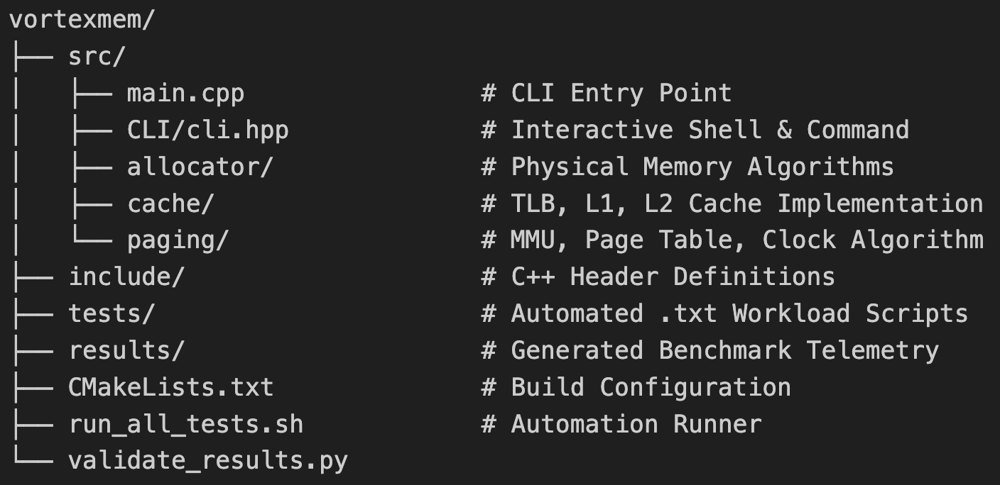

# VortexMem

VortexMem is an interactive memory management simulator implementing physical memory allocation, multi-level cache simulation, and virtual memory management with clock replacement policies. This project demonstrates key operating system and computer architecture concepts including heap allocation strategies, translation lookaside buffer (TLB) performance, and virtual-to-physical address translation.


## Features

### Memory Allocation

VortexMem supports multiple physical memory allocation strategies:

- First-Fit Allocation
- Best-Fit Allocation
- Worst-Fit Allocation
- Buddy System Allocation

The simulator tracks:

- Memory utilization
- External fragmentation
- Internal fragmentation
- Allocation success and failure rates

This makes it easy to compare the behavior and trade-offs of different allocation algorithms under the same workload.


### Cache and TLB Simulation

The simulator includes a simple multi-level memory hierarchy:

- Translation Lookaside Buffer (TLB)
- L1 Cache
- L2 Cache

Features include:

- Configurable cache sizes and associativity
- FIFO and LRU replacement policies
- Cache hit and miss tracking
- Temporal and spatial locality experiments

Users can issue read and write requests and observe how accesses propagate through the cache hierarchy.


### Virtual Memory and Paging

It includes a virtual memory subsystem that performs:

- Virtual-to-physical address translation
- Page fault handling
- Frame allocation
- Dirty page tracking
- Clock (Second-Chance) page replacement

When pages are evicted, the simulator records disk write-backs for modified pages, mimicking operating system paging behavior.


## Building the Project

### Prerequisites

- C++17 compatible compiler (GCC, Clang, or MSVC)
- CMake

### Build Instructions

```bash
# Clone the repository and enter the directory
mkdir build && cd build
cmake ..
make

# Launch the interactive CLI (run this from "build" directory)
./vortexmem
```


## Interactive CLI
After launching the simulator:

text VortexMem Command Line Interface Type 'help' for commands. 

### Available Commands

```init memory <size> <first|worst|best|buddy>``` - Boot the physical RAM<br>
```init pipeline``` - Initialize the TLB, caches, and paging system<br>
```malloc <id> <size>``` - Allocate memory<br>
```free <id>``` - Deallocate memory<br>
```read <hex_address>``` - Simulate a memory read<br>
```write <hex_address>``` - Simulate a memory write<br>
```dump``` - Display the memory layout<br>
```stats``` - Display allocator and hardware metrics<br>
```help``` - Show available commands<br>
```exit``` - Close the simulator<br>


## Example Session


## Empirical Benchmarks
VortexMem includes an automated test suite (```run_all_tests.sh```) to prove architectural soundness. You can run that using -
```bash
# run from root directory and results will be compiled in results/

./run_all_tests.sh
```
 Here are results from the simulator engine.

1. Allocator Comparison: First-Fit vs Buddy System
Testing identical workloads reveals the exact trade-offs between allocator types. First-Fit creates external holes, while Buddy padding wastes space internally.

### First-Fit Profile:

```
Memory Utilization:     34.18%
External Fragmentation:  7.42%
Internal Fragmentation:  0.00%
```
### Buddy System Profile:

```
Memory Utilization:     50.00%
External Fragmentation: 0.00%
Internal Fragmentation: 31.64%
```

### Multi-Level Cache Cascades (The L2 Rescue)
Reading contiguous memory ```0x1000``` followed by ```0x1020```. ```0x1020``` misses the small L1 line size, but hits the larger L2 line size.

```
Average Memory Access Time (AMAT): 5056 cycles
[Paging Telemetry] Page Faults: 1 | Disk Write-Backs: 0
TLB          -> Hits: 1      Misses: 1      Hit Rate: 50.00%
L1           -> Hits: 0      Misses: 2      Hit Rate: 0.00%
L2           -> Hits: 1      Misses: 1      Hit Rate: 50.00%
```
### Operating System Page Replacement
Flooding the memory with ```write``` commands to unique pages forces the MMU to swap out dirty pages to disk using the Clock replacement algorithm.

```
--- Hardware Pipeline Metrics ---
[Paging Telemetry] Page Faults: 9 | Disk Write-Backs: 5
```

## Project Structure




### License
Made for educational purposes<br>
By Rishav Kumar